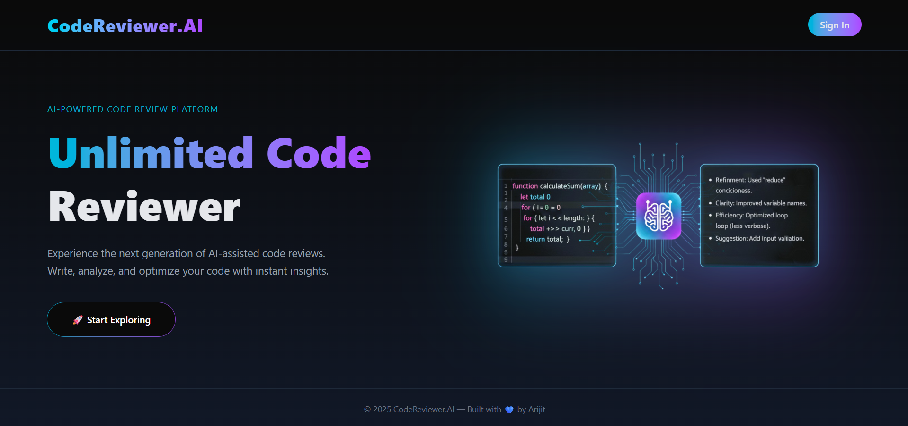
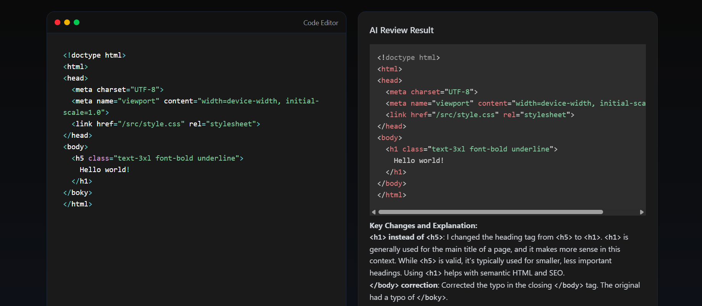

# 💻 Write. Review. Improve. — An AI-powered code editor that reviews your code in real time.

A full-stack **AI-powered Code Review Website** that allows users to write, edit, and get instant feedback on their code using **GenAI**.  
It provides an interactive **code editor** with syntax highlighting powered by **Prism.js**, and the backend uses **Node.js + Express.js** to process AI-driven code reviews.

---

## 🧠 Features

- 💻 **Interactive Code Editor** – Write and edit code in real-time with Prism.js syntax highlighting.  
- 🤖 **AI-Powered Code Review** – Get instant feedback, suggestions, and improvements from a GenAI model.  
- ⚙️ **Full Stack Application** – Built with React (frontend) and Node.js/Express (backend).  
- 🔄 **Dynamic Language Support** – Supports multiple programming languages.  
- 🧾 **Real-Time Review Output** – See AI-generated review responses instantly after submission.  
- 🧠 **Modern UI** – Clean and responsive interface built with ReactJS and CSS.  
- 🔒 **Secure API Integration** – Communicates seamlessly between client and server using Axios.

---
## Images

---

## 🏗️ Tech Stack

| Category | Technologies Used |
|-----------|-------------------|
| **Frontend** | React.js, Prism.js, React Simple Code Editor, Axios |
| **Backend** | Node.js, Express.js |
| **AI Integration** | GenAI API |
| **Styling** | CSS, Prism Tomorrow Theme |
| **Others** | Markdown Rendering, REST APIs |

